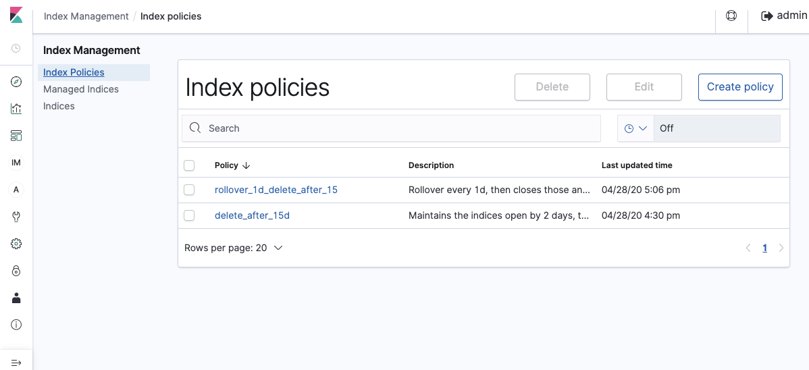
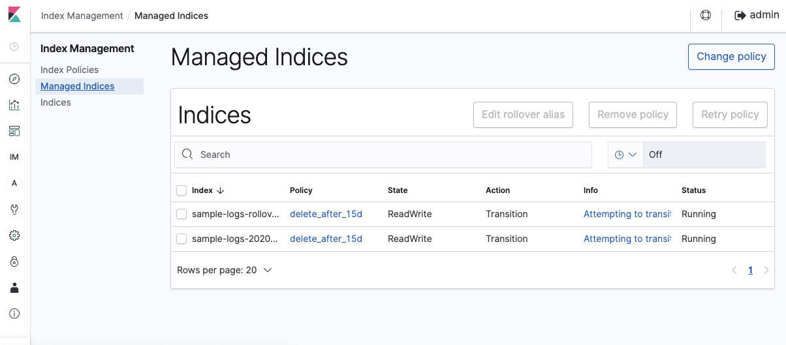
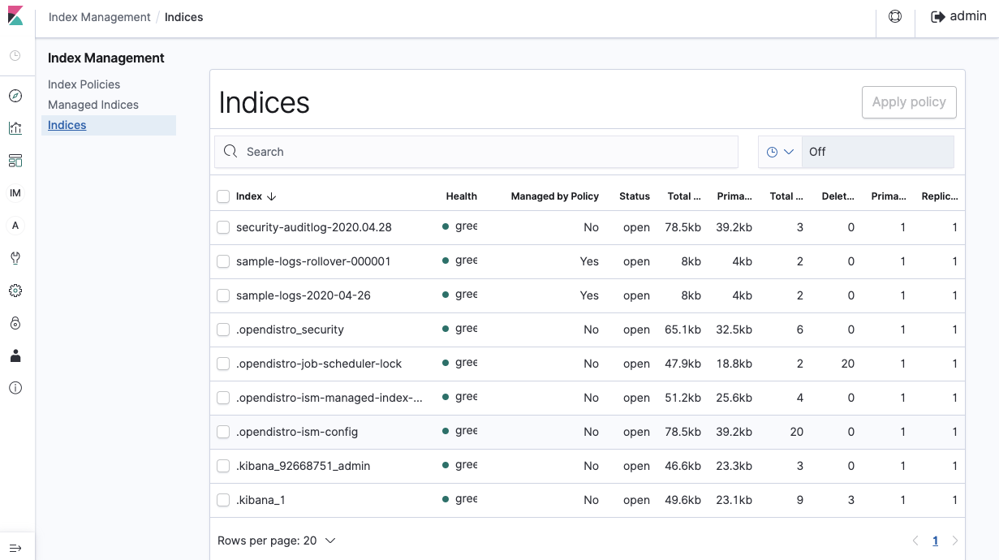

# Elasticsearch index lifecycle

This a support information for my post [Managing the Lifecycle of your Elasticsearch Indices](https://slashdevops.com/2020/04/30/managing-the-lifecycle-of-your-elasticsearch-indices-open-distro-for-elasticsearch)

and here you has a group of policies and templates using [Index State Management](https://opendistro.github.io/for-elasticsearch-docs/docs/ism/)

* [Policies](policies)
* [Templates](templates)

## How to test these

### Start Open Distro for Elasticsearch Cluster

__Note:__ `docker-compose.yml` file came from [SAMPLE DOCKER COMPOSE FILE](https://opendistro.github.io/for-elasticsearch-docs/docs/install/docker/)

```bash
docker-compose down -v
docker-compose up
```

## Kibana dev tool commands

After start `Open Distro for Elasticsearch Cluster` Kibana is listening in [http://localhost:5601](http://localhost:5601)

Kibana Dev Tools looks like


### Case 1

This case is when

> Third-party applications that use their own index name pattern like indexname-yyyy-mm-dd
> and I cannot / I don't want to change it.
> EJ: Zipkin (zipkin-2020-04-25)

or

> My log management/aggregation application makes the "rollover" of my indices, but I would
> like to delete/change those after some time has past -- The most common

#### Create ISM Policy delete_after_15d

```json
PUT _opendistro/_ism/policies/delete_after_15d
{
    "policy": {
        "policy_id": "delete_after_15d",
        "description": "Maintains the indices open by 2 days, then closes those and delete indices after 15 days",
        "default_state": "ReadWrite",
        "schema_version": 1,
        "states": [
            {
                "name": "ReadWrite",
                "actions": [
                    {
                        "read_write": {}
                    }
                ],
                "transitions": [
                    {
                        "state_name": "ReadOnly",
                        "conditions": {
                            "min_index_age": "2d"
                        }
                    }
                ]
            },
            {
                "name": "ReadOnly",
                "actions": [
                    {
                        "read_only": {}
                    }
                ],
                "transitions": [
                    {
                        "state_name": "Delete",
                        "conditions": {
                            "min_index_age": "13d"
                        }
                    }
                ]
            },
            {
                "name": "Delete",
                "actions": [
                    {
                        "delete": {}
                    }
                ]
            }
        ]
    }
}
```

#### Create the template sample-logs to apply the ISM Policy delete_after_15d to new indices

```json
PUT _template/sample-logs
{
    "index_patterns": [
        "sample-logs-*"
    ],
    "settings": {
        "index.opendistro.index_state_management.policy_id": "delete_after_15d"
    }
}
```

#### Change the oldest indices definition to apply the ISM Policy delete_after_15d

```json
PUT sample-logs-2020-*/_settings
{
  "settings": {
    "index.opendistro.index_state_management.policy_id": "delete_after_15d"
  }
}
```

# Bulk load sample to test the ISM policy

```json
POST _bulk
{"index": { "_index": "sample-logs-2020-04-26"}}
{"message": "This is a log sample 1", "@timestamp": "2020-04-26T11:07:00+0000"}
{"index": { "_index": "sample-logs-2020-04-26"}}
{"message": "This is a log sample 2", "@timestamp": "2020-04-26T11:08:00+0000"}
```

### Case 2

This case is when

> My own log aggregator (custom AWS Lambda function) and/or third-party applications
> like fluentd, LogStash,  etc. That allow me to change the index name pattern.
> So, in this case I can decide how to aggregate my logs and the index pattern name I want to use.

or

>

#### Create the ISM Policy rollover_1d_delete_after_15

```json
PUT _opendistro/_ism/policies/rollover_1d_delete_after_15
{
    "policy": {
        "policy_id": "rollover_1d_delete_after_15",
        "description": "Rollover every 1d, then closes those and delete indices after 15 days",
        "default_state": "Rollover",
        "schema_version": 1,
        "states": [
            {
                "name": "Rollover",
                "actions": [
                    {
                        "rollover": {
                            "min_index_age": "1d"
                        }
                    }
                ],
                "transitions": [
                    {
                        "state_name": "ReadOnly",
                        "conditions": {
                            "min_index_age": "2d"
                        }
                    }
                ]
            },
            {
                "name": "ReadOnly",
                "actions": [
                    {
                        "read_only": {}
                    }
                ],
                "transitions": [
                    {
                        "state_name": "Delete",
                        "conditions": {
                            "min_index_age": "13d"
                        }
                    }
                ]
            },
            {
                "name": "Delete",
                "actions": [
                    {
                        "delete": {}
                    }
                ],
                "transitions": []
            }
        ]
    }
}
```

#### Create the template sample-logs-rollover to apply the ISM Policy rollover_1d_delete_after_15 to new indices

```json
PUT _template/sample-logs-rollover
{
    "index_patterns": [
        "sample-logs-rollover-*"
    ],
    "settings": {
        "index.opendistro.index_state_management.policy_id": "rollover_1d_delete_after_15",
        "index.opendistro.index_state_management.rollover_alias": "sample-logs-rollover"
    }
}
```

#### Create the first rollover manually (it is necessary) to trigger ISM Policy association

```json
PUT sample-logs-rollover-000001
{
    "aliases": {
        "sample-logs-rollover":{
            "is_write_index": true
        }
    }
}
```

#### Bulk load sample

__NOTE:__ See how I use the `rollover aliases` to insert the new data

```json
POST _bulk
{"index": { "_index": "sample-logs-rollover"}}
{"message": "This is a log sample 1", "@timestamp": "2020-04-26T11:07:00+0000"}
{"index": { "_index": "sample-logs-rollover"}}
{"message": "This is a log sample 2", "@timestamp": "2020-04-26T11:08:00+0000"}
```

## Graphical result


### Kibana Index Management / Policies



### Kibana Index Management / Managed Indices



### Kibana Index Management / Indices


